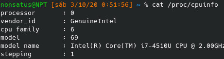
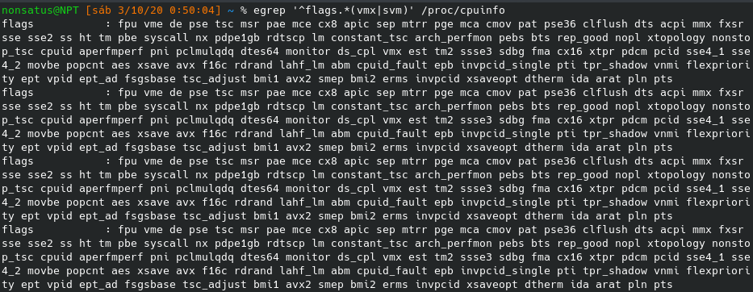
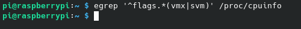
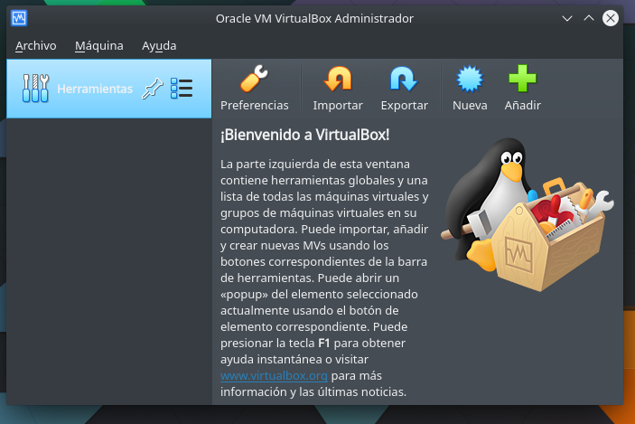
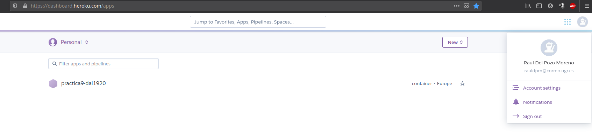

## Tema 1 - Introducción: conceptos y soporte físico

---
1. Consultar en el catálogo de alguna tienda de informática el precio de un ordenador tipo servidor y calcular su coste de amortización a cuatro y siete años. Consultar [este artículo en Infoautónomos sobre el tema](https://www.infoautonomos.com/consultas-a-la-comunidad/988/).

La pagina que he consultado es Amazon, donde he escogido el siguiente [servidor](https://www.amazon.es/HP-ProLiant-DL380-G6-Servidor/dp/B004ZHE3MK/ref=sr_1_6?__mk_es_ES=%C3%85M%C3%85%C5%BD%C3%95%C3%91&dchild=1&keywords=servidor&qid=1601674062&refinements=p_36%3A1000000-&rnid=1323854031&s=computers&sr=1-6), con un coste de 14.653,14€.

Asumo que el precio dado es sin IVA, ya que no se indica si lo tiene o no, dando un precio final de 14.653,14€ + (14.653,14€ * 21%) = 17.730,29€.

La máxima amortización aplicable anual es del 25% de la base imponible o precio sin IVA, en este caso voy a estipular que se aplica un 10% y se aplica un método de amortización lineal.

Este tipo de amortización se calcula de la siguiente forma:

> Cuota = (Valor adquisición - Valor residual) / Años vida util

> Valor residual = 10% * 17.730,29€ = 1773.02€.

> Cuota anual para 4 años = (17.730,29€ - 1773.02€) / 4 = 3989,31€ anuales.

> Cuota anual para 4 años = (17.730,29€ - 1773.02€) / 7 = 2279,61€ anuales.

---

3. En general, cualquier ordenador con menos de 5 o 6 años tendrá estos flags. ¿Qué modelo de procesador es? ¿Qué aparece como salida de esa orden? Si usas una máquina virtual, ¿qué resultado da? ¿Y en una Raspberry Pi o, si tienes acceso, [el procesador del móvil](https://stackoverflow.com/questions/26239956/how-to-get-specific-information-of-an-android-device-from-proc-cpuinfo-file)?

Mi portátil tiene un procesador Intel i7-4510U a 2GHz.

Con las siguientes flags.

En el caso de mi movil ([Leeco S3](https://www.kimovil.com/es/donde-comprar-leeco-le-s3)), dispone de un procesador   MediaTek Helio X20 (MT6797)

En mi RPI3, el resultado ha sido vacío, lo que quiere decir que o no tiene, o las tiene desactivadas.

---

4. Instalar un hipervisor para gestionar máquinas virtuales, que más adelante se podrá usar en pruebas y ejercicios. Usar siempre que sea posible un hipervisor que sea software libre.

Para este ejercicio voy a instalar *Virtual Box* mediante la orden "sudo pacman -S virtualbox" (uso Arch Linux).

Una vez que ha terminado de instalar, se puede comprobar que se ha instalado ejecutándolo.

---

5. Darse de alta en una web que permita hacer pruebas con alguno de los sistemas de gestión de nube libres como los mencionados en los párrafos anteriores, aunque sea temporalmente. Si la prueba es menos de un mes, simplemente anotarlo y dejarlo para el mes de diciembre, más o menos.

Estoy registrado en [Heroku](https://www.heroku.com/), web que utilice el año pasado en la asignatura DAI para la [practica 9](https://practica9-dai1920.herokuapp.com).

