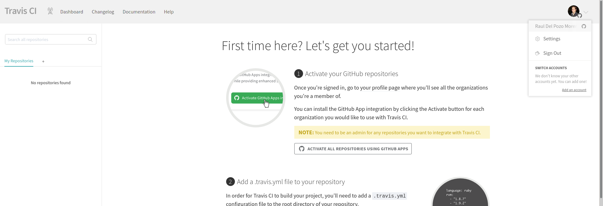
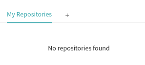
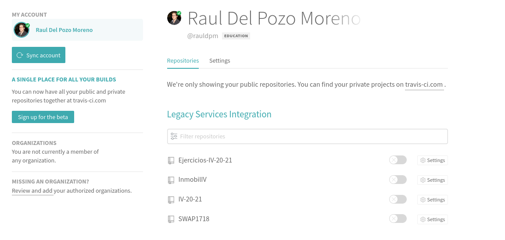
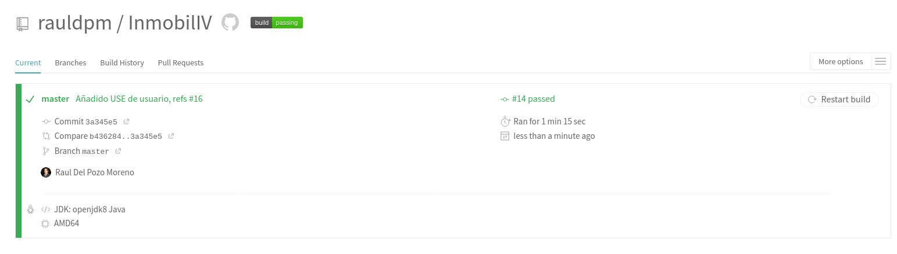

## Tema 2 - Desarrollo basado en pruebas.

---

Contenido teórico [aquí](http://jj.github.io/IV/documentos/temas/Desarrollo_basado_en_pruebas#aadiendo-integracin-continua).

---
9. Haced los dos primeros pasos antes de pasar al tercero.

   1. Darse de alta. Muchos están conectados con GitHub por lo que puedes autentificarte directamente desde ahí. A través de un proceso de autorización, puedes acceder al contenido e incluso informar del resultado de los tests a GitHub.

    Travis permite darse de alta usando la cuenta de GitHub, por lo que solo hay que concederle permisos.

    Una vez que se haya hecho esto, se verá la siguiente pagina, donde se podrá ver nuestra imagen de usuario de GitHub y nos dará información para activar un repositorio.

    

   2. Activar el repositorio en el que se vaya a aplicar la integración continua. Travis permite hacerlo directamente desde tu configuración; en otros se dan de alta desde la web de GitHub.

    En la imagen del apartado anterior se puede ver información para realizar este punto a cabo, para ello, pero no quiero activar todos mis repositorios sino solo el repositorio en el que se esta desarrollando la aplicación.

    Para ello, en el panel de la izquierda, que muestra los repositorio actuales (vacío) se pulsará sobre el "+" que aparece.

    

    Al pulsarlo cambiará a una ventana donde se podrá ver los repositorios actuales y donde podremos activarlo.

    

    Se activa:

    

---
10. Configurar integración continua para nuestra aplicación usando Travis o algún otro sitio.

    En este paso creare un fichero de configuración de travis para la aplicación que se esta desarrollando, para ello, creare un fichero llamado ".travis.yml". 

    **Es importante el punto antes de travis ya que sino, Travis no detecta el fichero**

    Aquí hay un problema, y es que Travis no contempla Kotlin como lenguaje, por lo que hay que añadirlo.

    Como se puede ver en el siguiente issue, se contempla la opción de marcar "Java" como lenguaje en vez de "Kotlin" si se esta utilizando Gradle (se usa) y Maven (se usa) https://github.com/travis-ci/travis-ci/issues/7833

    En el panel izquierdo de este [enlace](https://docs.travis-ci.com/?utm_source=help-page&utm_medium=travisweb) se puede comprobar la lista de lenguajes admitidos por Travis.

    Cada vez que se realize un push al repositorio activado, se realizara un build con la configuración indicada en el fichero travis.yml

    Asi, una configuración muy básica seria indicar el lenguaje usado:

    - language: lenguaje que se use

    [Aquí](files/tema2/.travis.yml) se puede comprobar el fichero .travis.yml creado.

    Una vez que se haga push, en Travis se verá que se ha lanzado un build automáticamente y se podrá ver el estado del mismo.
    
    