## Tema 3 - Usando contenedores.

---

Contenido teórico [aquí](https://jj.github.io/IV/documentos/temas/Contenedores).

---

1. Instalar docker y/o otro gestor de contenedores como Podman/Buildah

    Para Instalar docker he utilizado la orden:

    > sudo pacman -S docker

    Se puede ver que se ha instalado correctamente comprobando la version de docker mediante el comando:

    >docker --version

    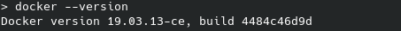

    Para instalar Podman he utilizado la orden:

    > sudo pacman -S podman

    Se puede ver que se ha instalado correctamente comprobando la version de podman:

    > podman --version

    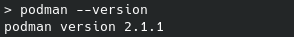

---
2. Instalación alternativa y DB 
    1. Instalar a partir de docker una imagen alternativa de Ubuntu y alguna adicional, por ejemplo de CentOS.

    Para realizar esto voy a instalar la imagen de Ubuntu en su version 14.04 (Trusty) y Centos, utilizando el comando "docker pull ...".

    > docker pull centos

    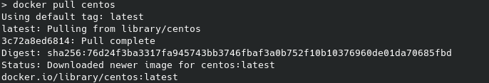

    > docker pull ubuntu:trusty

    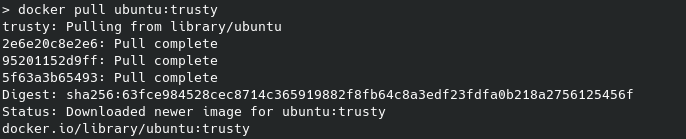

    Si se ejecuta el comando "docker images", se podrá observar las imágenes instaladas:

    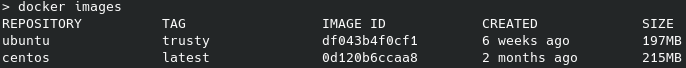

    2. Buscar e instalar una imagen que incluya MongoDB.

    Para esto se puede descargar directamente la [imagen oficial de mongo](https://hub.docker.com/_/mongo/), usando los comandos del apartado anterior:

    > docker pull mongo

    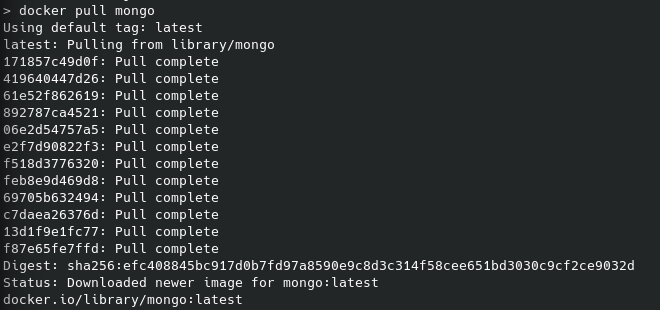

    > docker images

    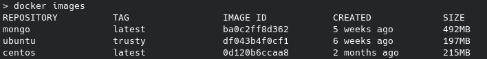

---
3. Crear un usuario propio e instalar alguna aplicación tal como nginx en el contenedor creado de esta forma, usando las órdenes propias del sistema operativo con el que se haya inicializado el contenedor.

    (Este ejercicio se podría haber resuelto usando la imagen "nginx/alpine", que utiliza el sistema "Alpine" y que ya trae instalado nginx, pero lo voy a realizar manualmente)

    Para realizar esto hay que crear un fichero "Dockerfile", en el que voy a utilizar la imagen de "alpine" ya que es muy liviana.

    Esto lo he indicado mediante el tag "FROM".

    > FROM alpine:latest

    Para crear un usuario he usado el tag "RUN" y para indicar el uso de dicho usuario con el tag USER:

    > RUN adduser -D userIV
    > USER userIV

    El siguiente paso es instalar nginx, esto se realiza mediante la orden "apk add nginx" ya que alpine utiliza el paquete "apk" para manipular paquetes.

    > RUN apk add nginx

    Ahora queda realizar el build con el dockerfile y ver si funciona.

    > docker build -t="tema3" .

    Este comando creara una imagen local con el nombre de "tema3".

    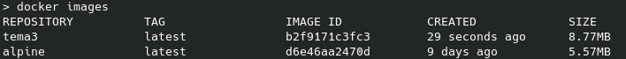

    Al ejecutar el build, se verá que existe un error, y es que se esta intentando instalar con permisos de usuario, cosa que no permite.

    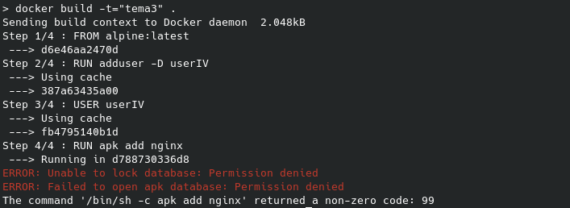

    Para solucionar esto, hay que realizar la instalación antes de crear o establecer el uso de usuario, al hacerlo, se vera que no hay problema:

    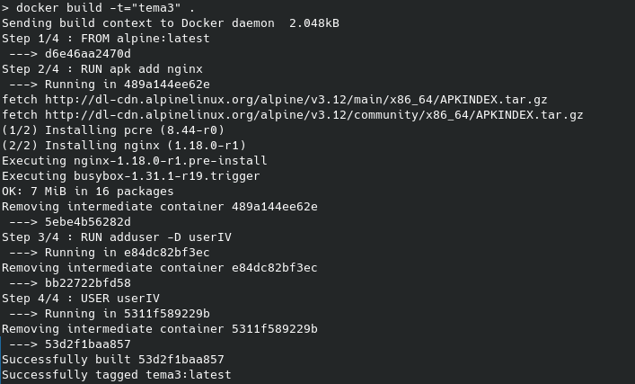

    Se puede consultar el Dockerfile en el siguiente [enlace](files/tema3/Dockerfile).

---
4. Crear a partir del contenedor anterior una imagen persistente con commit.

    Para realizar esto hace falta saber el ID que se ha creado de la imagen, esto se puede averiguar con el comando:

    > docker ps -a

    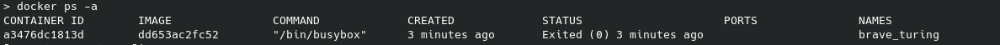

    El ID que se necesita es: b2f9171c3fc3a92ea5edd3f3b32525ae7e708e401ae95e4e16869765e6b0127d

    Ahora que se tiene el ID, hay que realizar un commit mediante el comando:

    > docker commit ID nombre
    > docker commit a3476dc1813d mi-tema3

    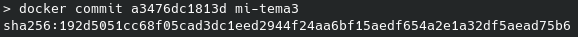

    Si se mira ahora en las imágenes locales se vera que hay una nueva imagen con el nombre dado:

    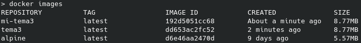

---
6. Desplegar un contenedor en alguno de estos servicios, de prueba gratuita o gratuitos.

    Para este ejercicio se va a realizar un despliegue en el registro de contenedores de github, con la imagen de la aplicación que se esta desarrollando en el hito 3.

    Se puede consultar en el siguiente [enlace](https://github.com/rauldpm/InmobilIV/blob/master/docs/github_registry.md).