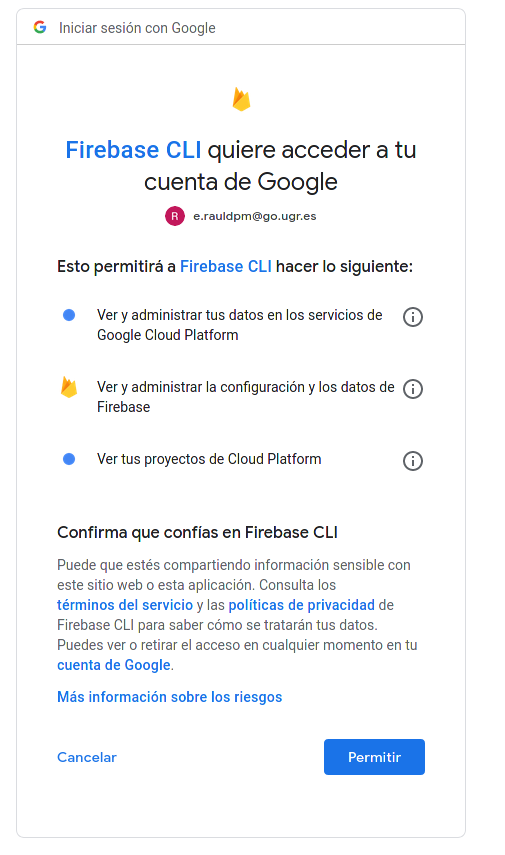
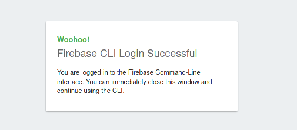
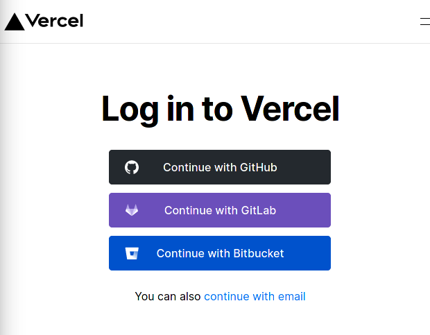
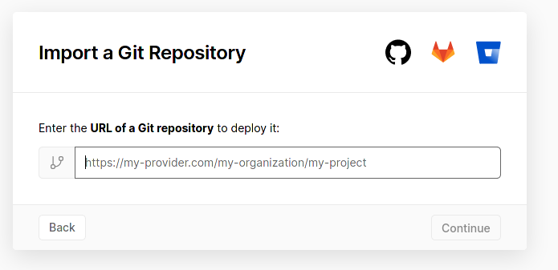
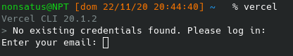
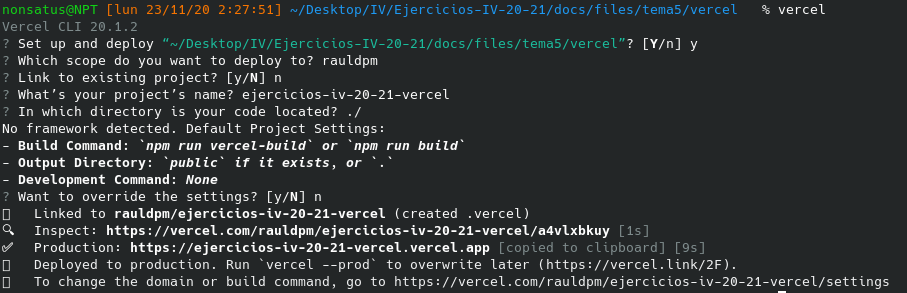
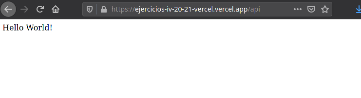

## Tema 5 - Serverless computing.

---

Contenido teórico [aquí](https://jj.github.io/IV/documentos/temas/Serverless) y [aquí](https://github.com/JJ/IV/blob/master/documentos/temas/Serverless.md).

---

1. Darse de alta en Vercel y Firebase, y descargarse los SDKs para poder trabajar con ellos localmente.

    - Firebase

    Para Firebase me he identificado directamente con la cuenta institucional @go.ugr.es.
    
    Para descargar el skd voy a utilizar npm ya que el CLI de firebase esta construido en Node.

    > sudo npm install -g firebase-tools

    Y para comprobar si se ha realizado correctamente se identifique con el comando:

    > firebase login

    Este comando abrirá una nueva ventana donde se podrá elegir la cuenta a usar y si se permite el uso:

    

    Si es exitoso se vera la siguiente ventana:

    


    - Vercel

    En el caso de Vercel es posible identificarse con la cuenta de GitHub.

    

    Una vez hecho se podrá importar un proyecto de HitHub si se desea.

    

    Para instalar el CLI voy a utilizar el repositorio AUR de mi sistema operativo.

    Para comprobar si se ha instalado correctamente hay que ejecutar por primera vez el comando "vercel" e identificarse con una cuenta.

    

    Si es correcto se vera en la terminal un mensaje de confirmación:

    


---

2. Tomar alguna de las funciones de prueba de Vercel, y hacer despliegues de prueba con el mismo.

    Lo siguiente es crear una carpeta para el proyecto, en este caso la llamare "api" y dentro creare un fichero llamado "index.js" con el siguiente contenido:

    ```
    module.exports = (req, res) => {
        const { name = 'World' } = req.query
        res.status(200).send(`Hello ${name}!`)
    }   
    ```

    Una vez creado el código, ejecutando el comando "vercel" hará el despliegue con algunas características indicadas en la ejecución la primera vez:

    

    Y yendo al [link indicado](https://ejercicios-iv-20-21-vercel.vercel.app/api) o desde la web de vercel, se podrá ver que funciona:

    

