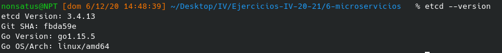
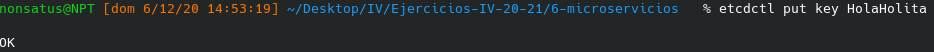
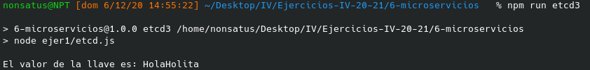
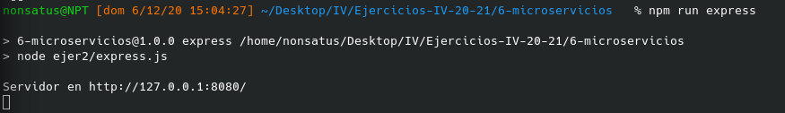
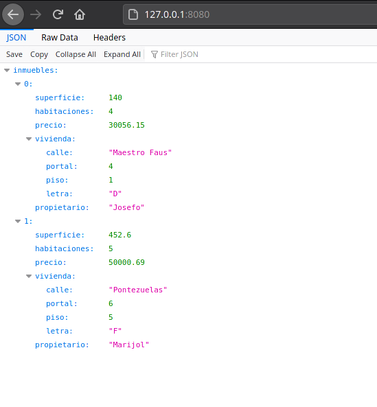
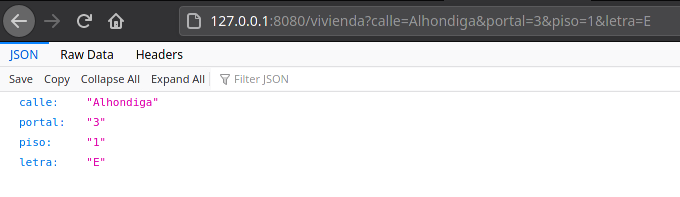
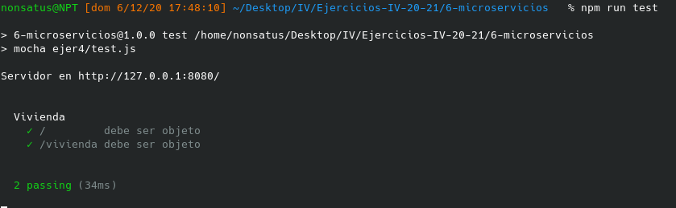

## Tema 6 - Microservicios.

---

Contenido teórico [aquí](https://jj.github.io/IV/documentos/temas/Microservicios) y [aquí](https://github.com/JJ/IV/blob/master/documentos/temas/Microservicios.md).

---
1. Instalar etcd3, averiguar qué bibliotecas funcionan bien con el lenguaje que estemos escribiendo el proyecto (u otro lenguaje), y hacer un pequeño ejemplo de almacenamiento y recuperación de una clave; hacer el almacenamiento desde la línea de órdenes (con etcdctl) y la recuperación desde el mini-programa que hagáis.

Para este ejercicio me he creado un miniproyecto en Node.js ya que para Kotlin no he terminado de encontrar una manera de usarlo, al menos de manera directa con el proyecto que estoy desarrollando en la asignatura, podría crear un proyecto Kotlin/JS pero su estructura seria incompatible con la del proyecto actual y ademas la única diferencia es que al realizar el build de Gradle, generaría la misma estructura de un proyecto Node.js en una subcarpeta por lo que realmente no veo necesario usarlo.

Asi, y siguiendo la documentación y ejemplos encontrado en este [enlace](https://microsoft.github.io/etcd3/classes/etcd3.html) he desarrollado el siguiente archivo [etcd.js](../6-microservicios/ejer1/etcd.js).

Para instalar etcd3 he utilizado el repositorio AUR de mi sistema operativo y a continuación se puede ver que se ha instalado correctamente:

Lo siguiente es iniciar el servicio mediante el comando:

> systemctl start etcd.service

Ahora que el servicio esta funcionado, es necesario instalar el servicio en el proyecto de node, mediante la orden:

> npm i --save etcd3

Para almacenar una clave hay que utilizar el siguiente comando:

> etcdctl put "key" "clave"

Como se ve, ha devuelto el indicador OK, por lo que se ha insertado correctamente.

Ahora, al ejecutar el programa, obtendrá dicha key y dará el valor de la clave dada, mediante la ejecución de:

> npm run etcd3

---
2. Realizar una aplicación básica que use express para devolver alguna estructura de datos del modelo que se viene usando en el curso.

El primer paso es añadir "express" al proyecto, mediante el comando:

> npm i --save express

Para este ejercicio voy a devolver información sobre los inmuebles de mi proyecto [InmobilIV](https://github.com/rauldpm/InmobilIV) en formato json, esto se puede ver en el archivo [express.js](../6-microservicios/ejer2/express.js).

Para ejecutarlo se hace mediante la orden:

> npm run express

Esto lanzara un servidor y estará a la escucha en el puerto 8080:

Si entonces se navega a la dirección "http://127.0.0.1:8080/", se podrá observar los datos json indicados en el fichero:

---
3. Programar un microservicio en express (o el lenguaje y marco elegido) que incluya variables como en el caso anterior.

Utilizando de base el ejercicio anterior, he añadido otra ruta "/vivienda" la cual va a recibir por parámetro get una serie de datos, y va a crear un objeto de tipo Vivienda, el cual va a ser devuelto en pantalla en formato json.

El fichero se llama [express_var.js](../6-microservicios/ejer3/express_var.js).

Ejemplo de ruta en navegador: 

> 127.0.0.1:8080/vivienda?calle=Alhondiga&portal=3&piso=1&letra=E

Para ejecutar hay que utilizar la orden:

> npm run express_var

Y si entonces se navega a la dirección anteriormente indicada se obtiene lo siguiente:

----
4. Crear pruebas para las diferentes rutas de la aplicación.

Para este ejercicio voy a utilizar Chai, Chai-http y Mocha, los cuales instalo mediante los comandos:

> npm i --save chai
>
> npm i --save chai-http
> 
> npm i --save mocha

El fichero que contiene los test es [test.js](../6-microservicios/ejer4/test.js).

Asi, ahora para ejecutar el test, no se especifica "node" en el script de [package.json](../6-microservicios/package.json), sino "mocha".

Para ejecutar el test hay que ejecutar:

> npm run test

El cual internamente ejecutará:

> mocha ejer4/test.js

Al ejecutarlo se puede observar que pasa los test:

