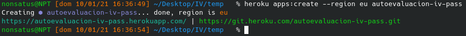
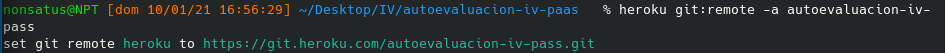
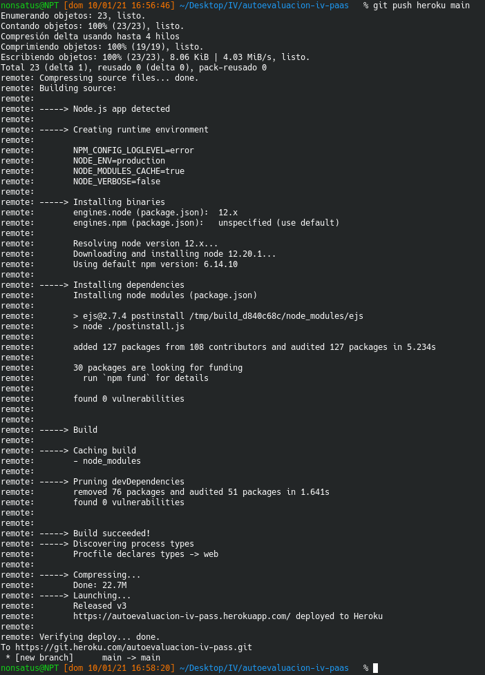
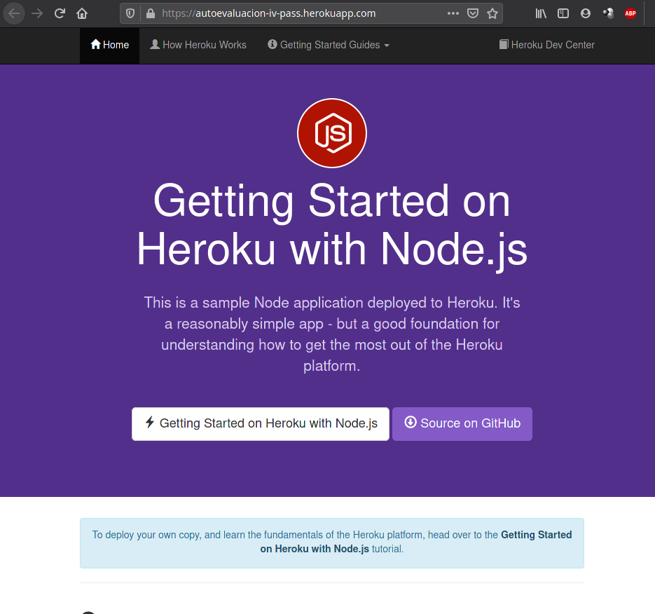
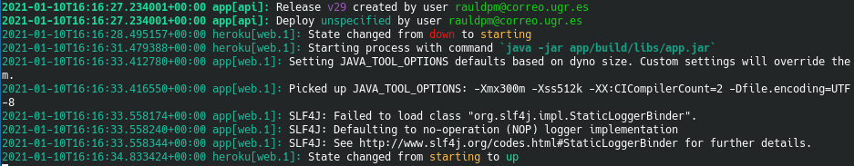
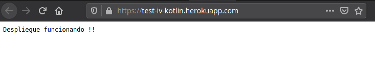
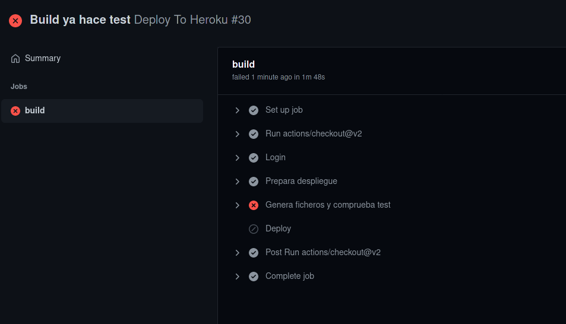
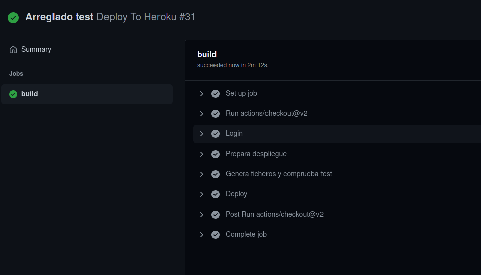
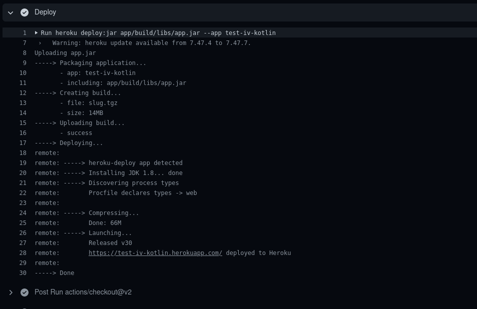

## Tema 7 - PaaS.

---

Contenido teórico [aquí](https://github.com/JJ/IV/blob/master/documentos/temas/PaaS.md) y [aquí](http://jj.github.io/IV/documentos/temas/PaaS).

---

1. Darse de alta en algún servicio PaaS tal como Heroku o BlueMix o usar alguno de los PaaS de otros servicios cloud en los que ya se esté dado de alta.

Para este ejercicio he elegido Heroku, ya que ya lo utilice el año pasado en la asignatura DAI y tengo un despliegue [hecho](https://practica9-dai1920.herokuapp.com).

---

2. Crear una aplicación en OpenShift o en algún otro PaaS en el que se haya dado uno de alta. Realizar un despliegue de prueba usando alguno de los ejemplos incluidos con el PaaS.

Para crear una aplicación en Heroku se puede hacer desde el mismo Heroku o desde linea de comandos:

```
heroku apps:create --region eu ejercicios-iv-paas
```


Ahora se descarga la aplicación para node de ejemplo:

git clone https://github.com/heroku/node-js-getting-started.git

Se crea un repositorio en Github llamado "autoevaluacion-iv-paas"

Se copia la aplicación node a nuestro repo y se pushea.

```
heroku git:remote -a autoevaluacion-iv-pass
git push heroku main
```





Ahora la aplicación estará desplegada en:

- [https://autoevaluacion-iv-pass.herokuapp.com/](https://autoevaluacion-iv-pass.herokuapp.com/)



---

3. Instalar y echar a andar tu primera aplicación en Heroku.

- Repositorio de la aplicacion: [Aqui](https://github.com/rauldpm/IV-Heroku-Test-Kotlin)
- Enlace al fichero taskrunner: [Aqui](https://github.com/rauldpm/IV-Heroku-Test-Kotlin/blob/main/app/build.gradle.kts)
- Enlace al fichero Procfile: [Aqui](https://github.com/rauldpm/IV-Heroku-Test-Kotlin/blob/main/Procfile)
- Enlace al fichero despliegue workflow actions: [Aqui](https://github.com/rauldpm/IV-Heroku-Test-Kotlin/blob/main/.github/workflows/heroku.yml)

Para este ejercicio he realizado una aplicación en Kotlin básica usando Ktor como framework y añadiendo una dependencia para crear Fat Jar en el taskrunner, de forma que al realizar el build de la aplicación se genere dicho jar que ejecutara la aplicación.

Esto lo hago debido a que la ejecución en una maquina virtual tarda demasiado, por lo que Heroku termina la ejecución, en cambio, con la ejecución del jar, se hace directo.


Dependencias añadidas:

```

import com.github.jengelman.gradle.plugins.shadow.tasks.ShadowJar

plugins {
  ...
  id("com.github.johnrengelman.shadow") version "6.1.0"
}

// Para crear el manifiesto del .jar
tasks.jar {
    manifest {
        attributes (
            "Main-Class" to "Heroku.Kotlin.MainKt"
        )
    }
}

// Para establecer un nombre personalizado al .jar
tasks.withType<ShadowJar>{ 
    archiveFileName.set("app.jar")
}

```

Para poder realizar el despliegue, se podría hacer mediante heroku-cli, pero he preferido instalar un plugin que añade una tarea al taskrunner:

- [Gradle plugins heroku](https://plugins.gradle.org/plugin/com.heroku.sdk.heroku-gradle)
- [Repositorio](https://github.com/heroku/heroku-gradle)

Hay que añadir lo siguiente al taskrunner:


```

plugins {
  ...
  id("com.heroku.sdk.heroku-gradle") version "2.0.0"
}

heroku {
    setAppName("test-iv-kotlin")
    setIncludeBuildDir(false)
    setJdkVersion("8")
    var list = listOf<String>("app/build/libs/app.jar")
    setIncludes(list)
}

```

Para que el despliegue funcione, es necesario añadir un fichero Procfile con el siguiente contenido:

```
web: java -jar app/build/libs/app.jar
```

E indicar a heroku que se va a hacer un despliegue de un jar

```
heroku stack:set heroku-20 --app test-iv-kotlin
```

Ahora, si se ejecuta la tarea:

```
gradle deployHeroku
```

Realizara un despliegue a la aplicación especificada en la configuración

Observando el log mediante el comando:

```
heroku logs --tail --app test-iv-kotlin
```

Se puede observar que se ha realizado correctamente.



Y accediendo mediante el navegador:



---

6. Preparar la aplicación con la que se ha venido trabajando hasta este momento para ejecutarse en un PaaS, el que se haya elegido.

Para este punto empece configurando travis para que realizara el despliegue a Heroku después de pasar los test, pero debido al cambio de política de créditos de Travis y que la tarea no funciona desde la ejecución del contenedor (no he identificado el motivo), he decidido renegar de Travis e implementar una GitHub Actions para que prepare el entorno, realice los test y ejecute el despliegue a Heroku.

Para ello, primero he implementado un test para testear la ruta servida por la aplicación, que comprueba si el contenido es el mismo.

Si falla, no realiza el despliegue ([link](https://github.com/rauldpm/IV-Heroku-Test-Kotlin/runs/1677224849?check_suite_focus=true)):



En caso correcto, si realiza el despliegue ([link](https://github.com/rauldpm/IV-Heroku-Test-Kotlin/runs/1677231197?check_suite_focus=true)):



Viendo dentro del log del action que se ha realizado:



Para que GitHub Actions pueda realizar el despliegue, es necesario añadir un secreto al repositorio, que contiene un Token Oauth con el que la identificación en heroku se hará automática.

Este secreto se tiene que llamar "HEROKU_API_KEY" y por algún motivo, al realizar el login tiene que estar en minúscula y al realizar el deploy en mayúscula (comprobado por prueba y error)

Este token se encuentra en la cuenta de Heroku bajo el apartado: API Key.